# ⛓️ Simple Blockchain in Java

> **An educational blockchain implementation built from scratch in Java, demonstrating cryptographic hashing, proof-of-work mining, RSA digital signatures, UTXO-style transactions, transaction mempool management, and blockchain integrity validation.**


---

## 📌 Overview

This project is a **from-scratch implementation of a simplified blockchain in Java**.

Rather than relying on an existing blockchain framework, the project implements the fundamental mechanisms directly using Java's standard libraries. It models a simplified cryptocurrency-style ledger in which users can transfer tokens, transactions are cryptographically signed and verified, pending transactions are maintained in a mempool, and valid transactions are mined into hash-linked blocks.

The implementation brings together several core blockchain concepts:

* 🔐 SHA-256 cryptographic hashing
* ⛏️ Proof-of-work mining
* 🔗 Hash-linked blocks
* 💰 UTXO-style token management
* ✍️ RSA digital signatures
* ✅ Transaction signature verification
* 📦 Transaction mempool
* 🛡️ Pending UTXO double-spend protection
* 🔎 Blockchain integrity validation
* 👤 Public/private key-based user identities

The project is intentionally designed as an **educational, single-node blockchain simulation** to make the underlying concepts easier to understand and experiment with.

---

## Architecture

The system is organized around six core classes:

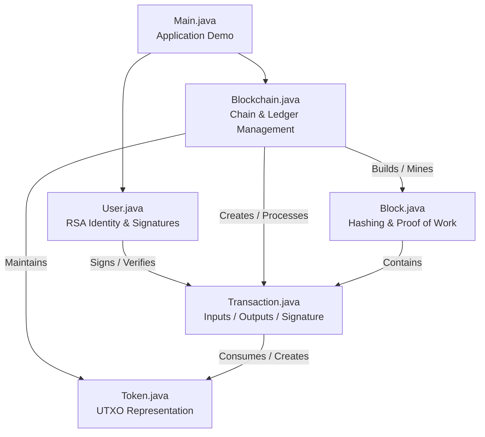

---

# Transaction Lifecycle

A transaction moves through several stages before becoming part of the blockchain.

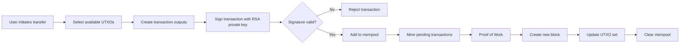

This separation between **transaction creation**, **pending transactions**, **mining**, and **ledger updates** mirrors important concepts found in cryptocurrency transaction systems.

---

# 🧱 Blockchain Structure

Each block stores its own hash as well as the hash of the previous block.

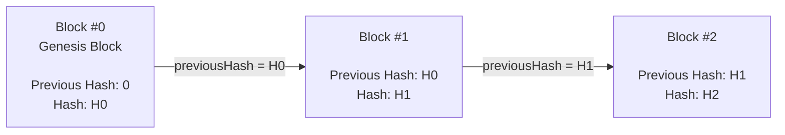

This creates a cryptographically linked chain.

If the contents of an earlier block are modified, its calculated hash changes. The following block still references the original hash, allowing the chain's integrity check to detect the modification.

---

# 🔐 Cryptographic Design

The project uses two major cryptographic mechanisms.

## SHA-256 Block Hashing

A block hash is calculated from:

```text
index + timestamp + transactions + previousHash + nonce
```

Conceptually:

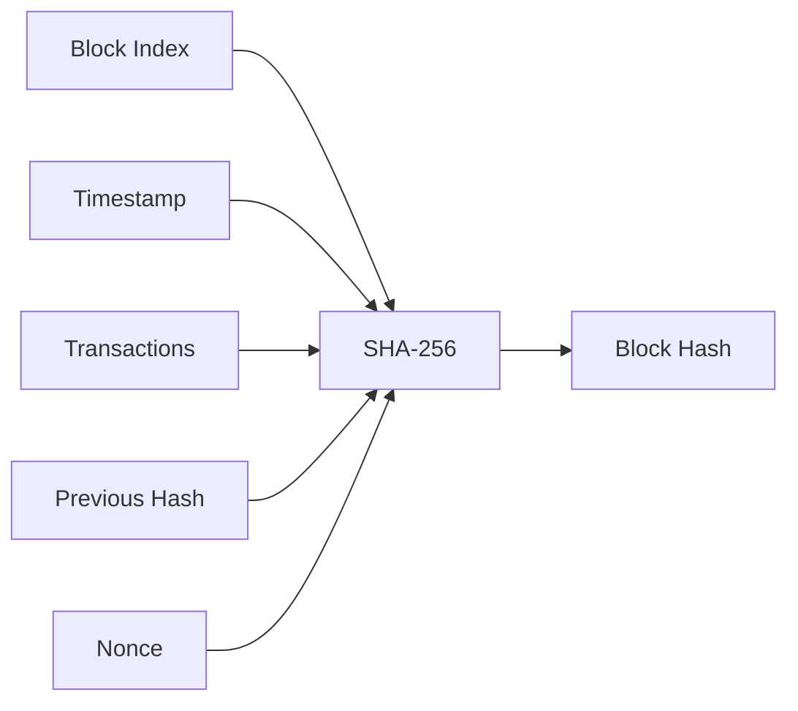

The implementation uses Java's `MessageDigest` API with SHA-256.

---

## 🔑 RSA Digital Signatures

Every `User` generates a **2048-bit RSA key pair**.

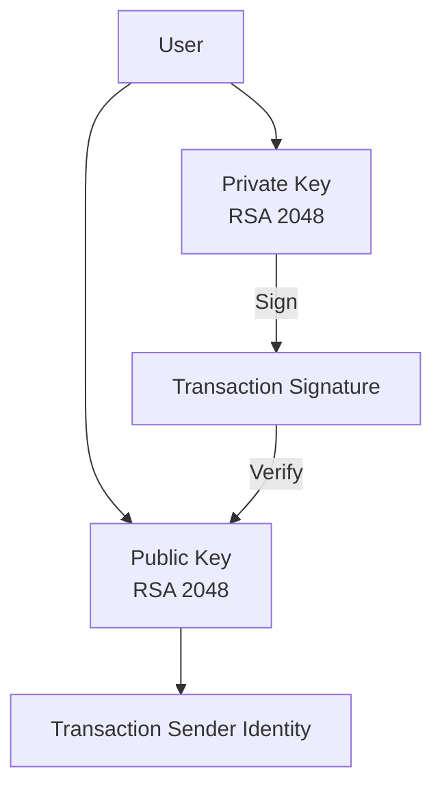

Transactions are signed using:

```text
SHA256withRSA
```

The signature is verified before a transaction is accepted into the mempool.

---

# Proof of Work

The blockchain implements a simplified proof-of-work mechanism.

The default mining difficulty is:

```text
4
```

The miner repeatedly changes the nonce until the resulting SHA-256 hash begins with four zeroes.

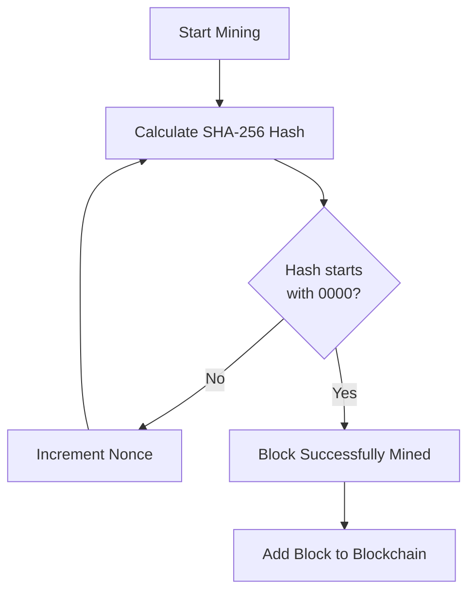

This provides a simple computational proof that work was performed to produce a valid block.

---

# UTXO-Style Token Model

Instead of maintaining simple account balances, the project models token ownership using **unspent transaction outputs (UTXOs)**.

For example, the initial genesis block creates:

```text
100 tokens → Hussain
```

If Hussain sends 20 tokens to Ahmed:

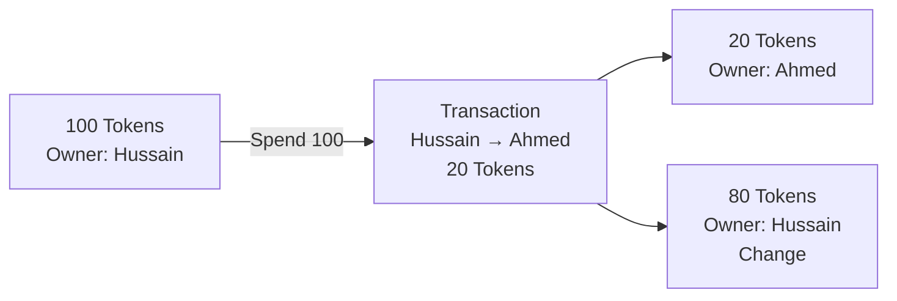

The original token output is consumed and replaced by new outputs.

This demonstrates the basic UTXO lifecycle:

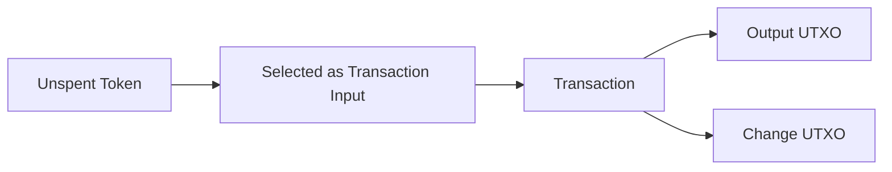

---

# 📦 Transaction Mempool

Transactions are not immediately written to the blockchain.

Instead, verified transactions are temporarily stored in a **mempool**.

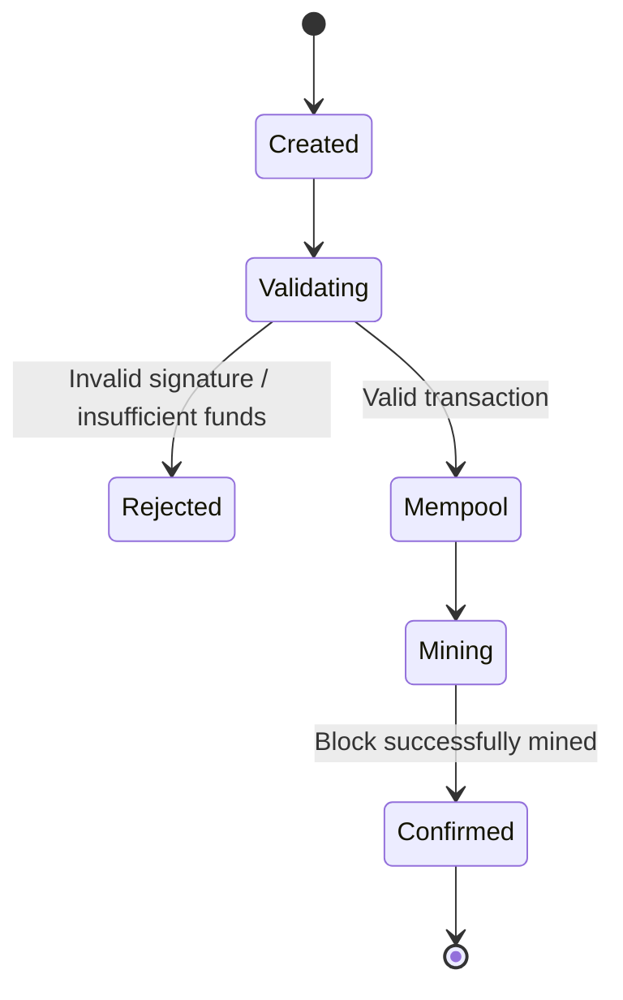

The mempool also tracks pending inputs so that the same UTXO cannot be selected by multiple pending transactions.

---

# 🛡️ Transaction Validation

Before a transaction enters the mempool, the implementation performs several checks.

### 1. UTXO Availability

The system searches for tokens belonging to the sender until enough value is collected to cover the requested amount.

### 2. Sufficient Funds

If the sender does not possess enough available tokens, the transaction is rejected.

### 3. Ownership Verification

The selected tokens must belong to the sender attempting to spend them.

### 4. Pending UTXO Protection

A token already being consumed by a transaction in the mempool cannot be selected again by another pending transaction.

### 5. Digital Signature Verification

The sender signs transaction information using their RSA private key, and the signature is verified using their public key.

Only after successful verification is the transaction added to the mempool.

---

# 🔎 Blockchain Integrity Validation

The blockchain provides a chain validation mechanism that checks the integrity of every block after the genesis block.

For each block, the implementation verifies:

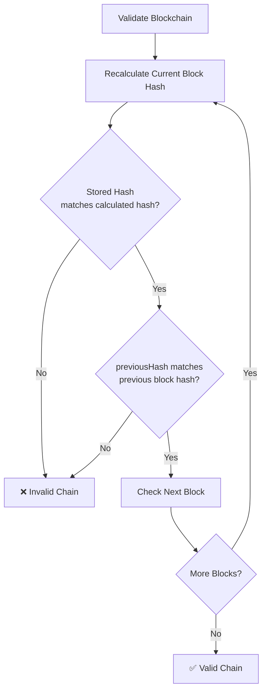

This detects basic tampering with block contents or block relationships.

---

# Demonstration Scenario

The `Main` class demonstrates the blockchain using three users:

```text
Hussain
Ahmed
Hassan
```

The blockchain starts with a genesis allocation of:

```text
100 tokens → Hussain
```

The demonstration then performs:

### Transaction 1

```text
Hussain → Ahmed : 20 tokens
```

The transaction is signed, verified, placed into the mempool, and mined.

### Transactions 2 & 3

```text
Hussain → Hassan : 10 tokens
Ahmed  → Hassan : 10 tokens
```

Both transactions are placed into the mempool and subsequently mined together.

The application finally prints the resulting blockchain and UTXO state.

---

# Complete System Flow

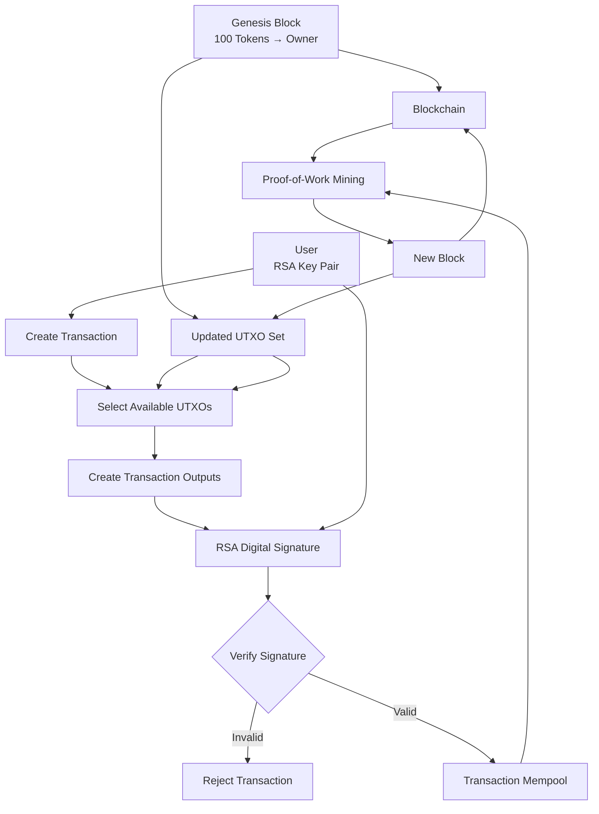

---

# 📁 Project Structure

```text
simple-blockchain/
│
├── src/
│   ├── Block.java
│   ├── Blockchain.java
│   ├── Main.java
│   ├── Token.java
│   ├── Transaction.java
│   └── User.java
│
├── .gitignore
└── README.md
```

## Source Code Responsibilities

| File               | Responsibility                                                                  |
| ------------------ | ------------------------------------------------------------------------------- |
| `Block.java`       | Block structure, timestamps, SHA-256 hashing and proof-of-work                  |
| `Blockchain.java`  | Blockchain state, UTXO management, transactions, mempool, mining and validation |
| `Main.java`        | Demonstration application and transaction workflow                              |
| `Token.java`       | UTXO-style token representation                                                 |
| `Transaction.java` | Transaction inputs, outputs and digital signature                               |
| `User.java`        | RSA key generation, transaction signing and signature verification              |

---

# Technology Stack

| Technology           | Purpose                                     |
| -------------------- | ------------------------------------------- |
| **Java 23**          | Core implementation                         |
| **SHA-256**          | Cryptographic block hashing                 |
| **RSA 2048**         | Public/private key cryptography             |
| **SHA256withRSA**    | Transaction digital signatures              |
| **Proof of Work**    | Block mining                                |
| **UTXO Model**       | Token ownership and transaction state       |
| **Java Collections** | Blockchain, transaction and UTXO management |

---

# 🚀 Getting Started

## Prerequisites

Install **Java 23** or a compatible newer Java version.

Verify your installation:

```powershell
java -version
javac -version
```

Expected environment:

```text
java version "23.0.1"
javac 23.0.1
```

---

## Compile

Clone the repository and navigate to the project directory.

Compile the Java source files:

```powershell
javac -d out src\*.java
```

---

## Run

Execute the main application:

```powershell
java -cp out Main
```

The program will demonstrate:

* User creation
* RSA key generation
* Token allocation
* Transaction creation
* UTXO selection
* Digital signature generation
* Signature verification
* Mempool processing
* Proof-of-work mining
* UTXO updates
* Block generation
* Blockchain output

---

# 🎯 Key Learning Outcomes

This project demonstrates practical understanding of:

* Blockchain data structures
* Cryptographic hash functions
* Hash chaining
* Proof-of-work concepts
* Public-key cryptography
* Digital signatures
* UTXO-based transaction models
* Transaction validation
* Mempool management
* Basic double-spend prevention
* Blockchain integrity verification
* Object-oriented programming in Java
* Java cryptography APIs

---

# ⚠️ Scope & Limitations

This project is intentionally an **educational blockchain implementation** rather than a production cryptocurrency or distributed blockchain network.

It currently does not implement:

* Peer-to-peer networking
* Multiple blockchain nodes
* Distributed consensus
* Persistent blockchain storage
* Wallet persistence
* Network-wide transaction propagation
* Smart contracts
* Block rewards
* Production-grade transaction serialization

The goal is to provide a compact implementation that makes the underlying blockchain mechanisms visible and understandable.

---

# Security & Design Notes

The project demonstrates real cryptographic primitives, but several components are intentionally simplified for educational purposes.

For example, the transaction signature covers a constructed transaction description rather than a canonical serialization of every transaction field. A production blockchain would generally require signatures to cryptographically commit to the complete transaction structure.

Similarly, blockchain validation currently focuses on block hashes and previous-block relationships rather than independently reconstructing and validating the complete UTXO state.

These design choices keep the implementation focused on demonstrating blockchain fundamentals while providing clear opportunities for future extension.

---

# 🔮 Potential Extensions

The implementation could be extended with:

* [ ] Persistent blockchain storage
* [ ] Transaction IDs
* [ ] Canonical transaction serialization
* [ ] Full transaction validation during chain verification
* [ ] Merkle trees for transaction organization
* [ ] Peer-to-peer networking
* [ ] Multiple blockchain nodes
* [ ] Distributed consensus
* [ ] Wallet/key persistence
* [ ] Block rewards
* [ ] Configurable transaction fees
* [ ] REST API
* [ ] Web-based blockchain explorer
* [ ] Automated unit and integration tests

---

# 💡 Why This Project?

Building a blockchain from scratch provides a practical way to understand what happens beneath higher-level blockchain platforms.

Rather than treating a blockchain as a black box, this implementation exposes the relationship between:

```text
Cryptography
     +
Transactions
     +
UTXOs
     +
Mempool
     +
Proof of Work
     +
Hash Chaining
     ↓
Blockchain
```

The result is a compact Java implementation that demonstrates how these individual mechanisms combine to form a basic cryptocurrency-style ledger.

---

## Author

**Syed Muhammad Hussain**

Computer Science student focused on **Data Engineering, Distributed Systems, Databases, and Software Development**.

---

## ⭐ Project Highlights

**Core Technologies**

`Java 23` · `SHA-256` · `RSA` · `Digital Signatures` · `Proof of Work` · `UTXO` · `Mempool` · `Blockchain`

**Implementation Focus**

`Cryptography` · `Transaction Processing` · `Data Integrity` · `Object-Oriented Design` · `Blockchain Fundamentals`

---

> **Educational project developed to explore the core mechanisms underlying blockchain-based transaction systems.**
